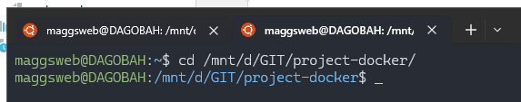

# 1. Start Docker-Desktop App

# 2. Launch in WSL, Ubuntu

- navigate to project directory



# 3. Start docker

```
docker-compose up
```

or click 'run' in Docker Desktop

# 4. Launch in Browser

Localhost : http://localhost/


Database state should be saved because of
```
  mysql:
    volumes:
      - dbData:/var/lib/mysql
```

